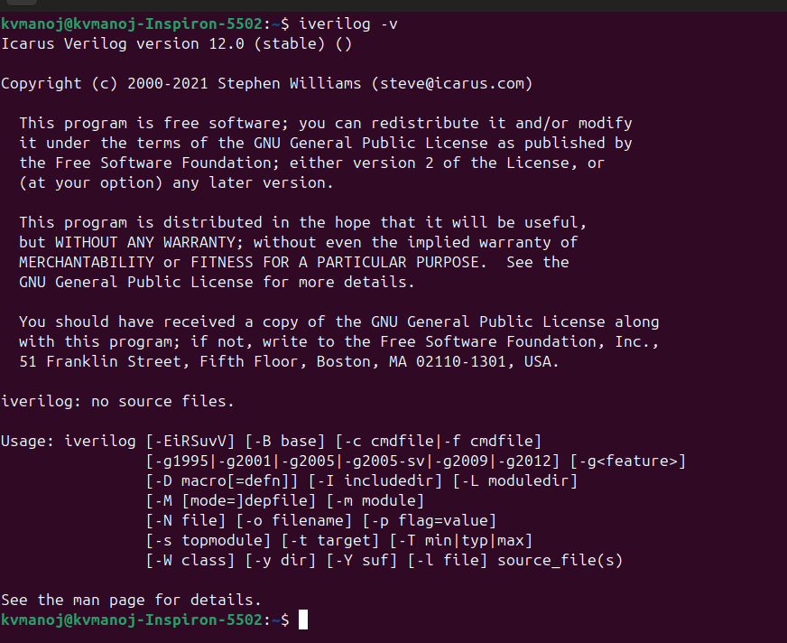
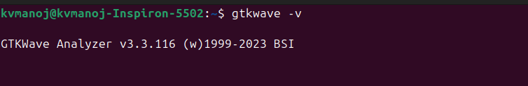
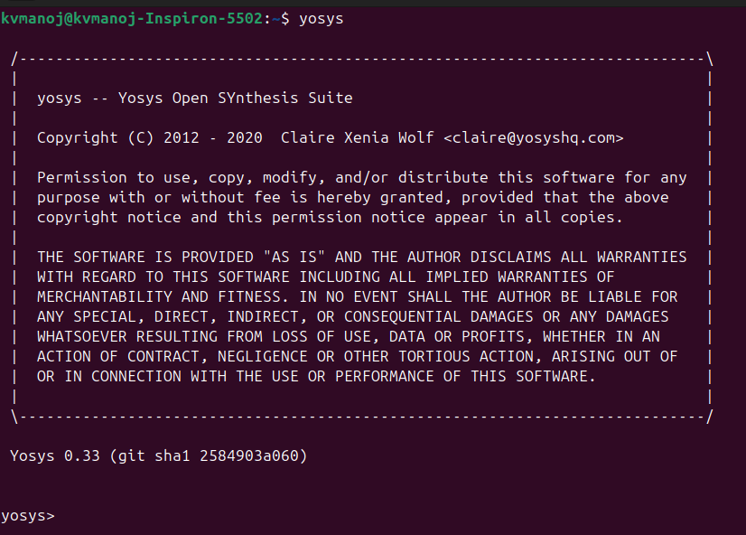

# Week 0 – Tool Installation

In this week, I set up the essential tools required for digital design and verification: **Icarus Verilog**, **GTKWave**, and **Yosys**. These tools will help us in simulation, waveform viewing, and synthesis throughout the course.

---

## 🔧 System Requirements

* **OS**: Ubuntu 20.04+
* **RAM**: 6 GB (minimum)
* **Disk**: 50 GB free space
* **CPU**: 4 cores

---

## 1️⃣ Icarus Verilog (iverilog)

**Purpose**:
Icarus Verilog is an open-source Verilog simulator. It is used to compile and simulate Verilog HDL code.

**Installation**:

```bash
sudo apt-get update
sudo apt-get install iverilog
```

**Check installation**:

```bash
iverilog -v
```

---


## 2️⃣ GTKWave

**Purpose**:
GTKWave is a waveform viewer used to visualize simulation outputs (VCD files). It allows debugging and analyzing signal behavior.

**Installation**:

```bash
sudo apt-get update
sudo apt-get install gtkwave
```

**Check installation**:

```bash
gtkwave -version
```

---



## 3️⃣ Yosys

**Purpose**:
Yosys is an open-source framework for RTL synthesis. It translates Verilog code into gate-level netlists for further digital design flows.

**Installation**:

```bash
sudo apt-get update
git clone https://github.com/YosysHQ/yosys.git
cd yosys
sudo apt install make build-essential clang bison flex \
    libreadline-dev gawk tcl-dev libffi-dev git \
    graphviz xdot pkg-config python3 libboost-system-dev \
    libboost-python-dev libboost-filesystem-dev zlib1g-dev

make config-gcc
make
sudo make install
```

**Check installation**:

```bash
yosys -V
```

---




